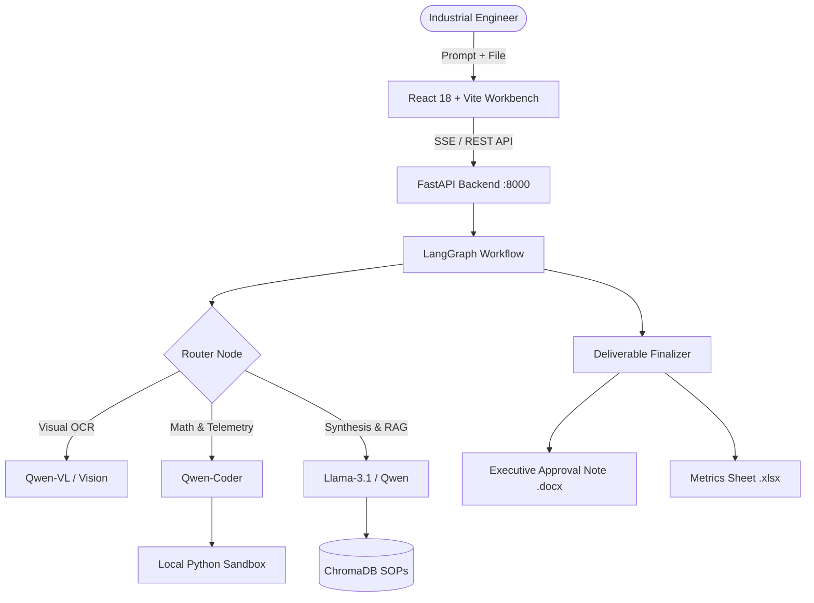

# 🛡️ Sentinel OS — Sovereign Air-Gapped Agent Workbench

[](LICENSE)
[](https://python.org)
[](https://fastapi.tiangolo.com/)
[](https://langchain-ai.github.io/langgraph/)
[](https://vitejs.dev/)
[](https://ollama.com/)

**Sentinel OS** is an air-gapped, sovereign AI agent workbench designed for critical industrial infrastructure, manufacturing plants, and petroleum refineries. It processes private telemetry, engineering documentation, and sensory logs with zero cloud data egress.

---

## 🌟 Key Capabilities

1. **🔒 Sovereign & Air-Gapped**: Runs 100% locally on premise. Zero cloud API calls, zero telemetry leakage.
2. **🧠 Multi-Agent Graph Architecture (LangGraph)**:
   - **Router Node**: Semantic dispatch to vision, code, or drafting brains.
   - **Coder Node**: Writes Python scripts for mathematical computation and data analysis.
   - **Drafter Node**: Synthesizes regulatory and engineering knowledge.
   - **Tool Node**: Local subprocess sandbox execution, RAG vector retrieval, and file generators.
   - **Finalize Node**: Produces verifiable executive deliverables.
3. **⚡ Local Subprocess Code Sandbox**:
   - Executes Python math and data science routines directly in an offline environment (Docker optional).
4. **📚 Persistent RAG Knowledge Base (ChromaDB)**:
   - Indexes local SOPs, OSHA refinery safety regulations, API standards, and equipment maintenance logs.
5. **📑 Executive Deliverable Generation**:
   - **Word Approval Notes (`.docx`)**: Automated management memos with structured metrics tables.
   - **Excel Metrics Sheets (`.xlsx`)**: Structured calculation tables, yield reconciliations, and anomaly logs.
6. **🎨 Retro-Futuristic Industrial Workbench UI**:
   - Real-time Server-Sent Events (SSE) streaming execution feed.
   - Agent thought monitor, tool invocation badges, and on-screen intelligence brief with 1-click copy.
   - Hardware telemetry gauges (VRAM, CPU, RAM, Latency).
   - Knowledge vault explorer.

---

## 🏗️ System Architecture



---

## 📁 Repository Structure

```
Sentinel_OS/
├── app/                        # FastAPI Backend & Agent Core
│   ├── api/                    # REST & SSE Endpoints (/workspace, /kb, /system)
│   ├── core/                   # Configuration, Docker health, Logging, Telemetry
│   ├── schemas/                # Pydantic request/response schemas
│   ├── services/
│   │   ├── agent/              # LangGraph nodes, router, state, prompts, schemas
│   │   ├── llm/                # Ollama client abstraction
│   │   ├── rag/                # ChromaDB vector store, text ingestion, embeddings
│   │   ├── tools/              # Python code sandbox, docx/xlsx file generators
│   │   └── workspace/          # Background task runner & SSE event streaming
│   └── main.py                 # FastAPI Application Entrypoint
├── frontend/                   # React 18 + Vite Industrial Workbench
│   ├── src/
│   │   ├── components/         # WorkspaceTab, PipelineTab, TelemetryTab, VaultTab
│   │   ├── styles/             # Halftone industrial design system & typography
│   │   └── services/api.js     # Backend REST & SSE client
│   ├── index.html
│   └── package.json
├── sample_data/                # Industrial Evaluation Datasets
│   ├── oil.csv                 # 32-row Wood Gasoline-Yield distillation data
│   ├── crude_distillation_yields.csv
│   ├── osha_petroleum_refinery_psm.txt
│   └── pump_condition_monitoring_report.txt
├── requirements.txt            # Python Dependencies
├── .env.example                # Configuration Template
└── README.md
```

---

## 🚀 Quick Start Guide

### Prerequisites
- Python 3.11 or higher
- Node.js 18+ and npm
- [Ollama](https://ollama.com/) installed with local models:
  ```bash
  ollama pull llama3.1:8b
  ollama pull qwen2.5-coder:7b
  ```

---

### 1. Backend Setup

```bash
# Navigate to repository
cd "Sentinel OS"

# Create and activate virtual environment
python -m venv .venv
# On Windows PowerShell:
.venv\Scripts\Activate.ps1
# On Linux/macOS:
source .venv/bin/activate

# Install Python dependencies
pip install -r requirements.txt

# Copy environment configuration
copy .env.example .env

# Start FastAPI backend daemon
cd app
python -m uvicorn main:app --host 127.0.0.1 --port 8000
```
Backend API will be live at: **`http://127.0.0.1:8000`**  
Swagger API Documentation: **`http://127.0.0.1:8000/docs`**

---

### 2. Frontend Setup

In a separate terminal:

```bash
cd "Sentinel OS/frontend"

# Install node dependencies
npm install

# Start Vite development server
npm run dev
```
Frontend Workbench will be live at: **`http://localhost:3000/workbench`**

---

## 📊 Sample Datasets & Evaluation Queries

Sample files are included in the `sample_data/` directory:

1. **Centrifugal Pump P-1042 Condition Monitoring (`pump_condition_monitoring_report.txt`)**:
   - *Prompt:* `"Analyze the Pump Condition Monitoring Report for Centrifugal Pump P-1042. How many high-severity events were logged and what were their root causes?"`
   - *Prompt:* `"Draft an executive engineering Approval Note (.docx) for Centrifugal Pump P-1042 following the standard anomaly template."`

2. **Wood Gasoline-Yield Dataset (`oil.csv`)**:
   - *Prompt:* `"How many rows/records are in the oil dataset and what is the average percentage yield across all records?"`
   - *Prompt:* `"Calculate average yield across distillation cuts in oil.csv and generate an executive yield reconciliation spreadsheet (.xlsx)."`

3. **OSHA Petroleum Refinery Safety Standard (`osha_petroleum_refinery_psm.txt`)**:
   - *Prompt:* `"What are the five key areas OSHA cited most often during the Petroleum Refinery PSM National Emphasis Program? Summarize key RAGAGEP codes."`

---

## 🛡️ License

This project is licensed under the MIT License.
